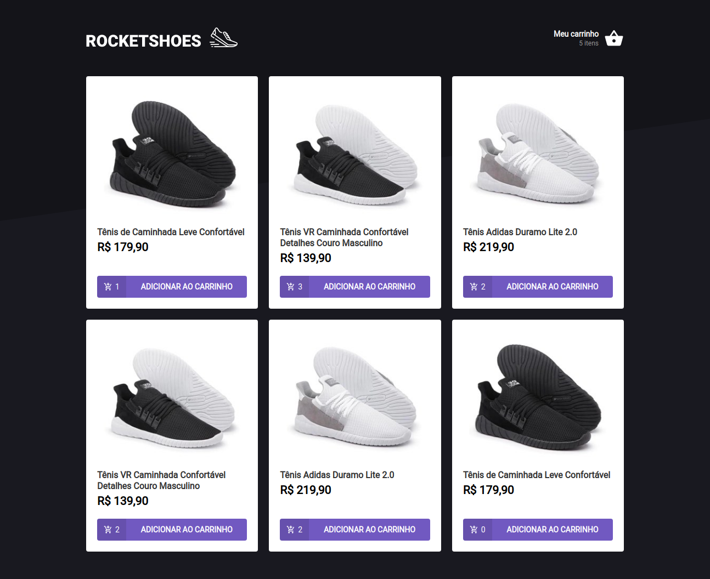
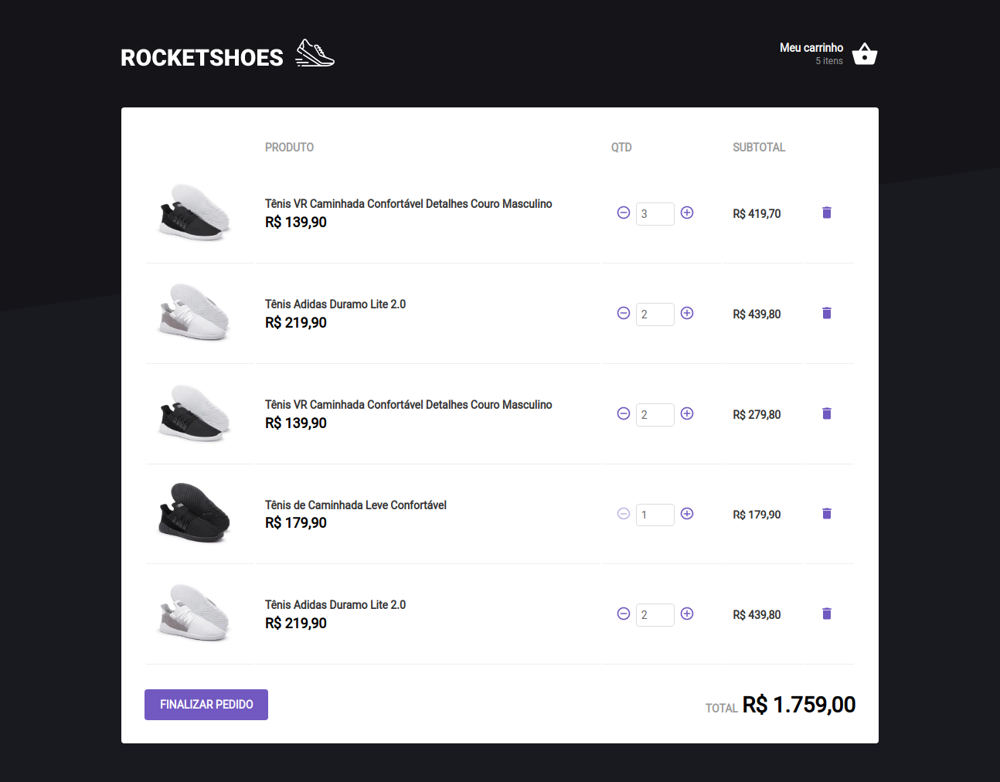

<h1 align="center">🚀 Rocketseat - 🔥Ignite - Trilha ReactJs</h1>

<h2 align="center">Desafio 01 - Criando um hook de carrinho de compras ( Projeto RocketShoes )</h2>

## 📖 Sobre o Projeto
O projeto consiste em uma aplicação de listagem de produtos tanto na Home como carrinho, que são consumidos de uma fake api, o desafio pede para adicionar o produto ao carrinho mostrando a quantidade dos produtos adicionados, além disso deve ser possível acrescentar e diminuir a quantidade do produto no carrinho, removê-lo do carrinho e a medida que for alterando a quantidade do produto no carrinho o total e o subtotal sejam alterando da mesma forma.

## 🌠 Imagens do projeto 



## 🧰 Tecnologias Utilizadas
* ReactJS
* Axios
* TypeScript
* Styled-Componets

## ⚙ Como rodar o projeto
#### Crie uma pasta 
```bash
mkdir react-ignite-criando-um-hook-carrinho
```
#### Clone este repositório para a pasta anterior ou use a opção de download:
```bash
git clone ignite-reactjs-criando-um-hook-de-carrinho-de-compras
```
#### Instale as dependências
```bash
yarn 
```
ou
```bash
npm install
```
#### Sobe o JSON Server que rode a api Fake para consumo dos dados dos arquivos json:
##### Abra um terminal que esteja na pasta do projeto e de o seguinte comando
```bash
yarn server
```
#### Executando o Projeto
```bash
yarn start
``` 
ou
```bash
npm start
```

#### Acesse http://localhost:3000 no seu navegador

## 🌎 Especificações do Projeto
[Desafio 01 - RocketShoes](https://www.notion.so/Desafio-01-Criando-um-hook-de-carrinho-de-compras-5769216778794019a83f544e79167b12) - Notion com todas as informações.

## Licença
&copy; MIT

Feito com ❤ por Alisson Romão Santos | [LINKEDIN](https://www.linkedin.com/in/alissonrsantos).